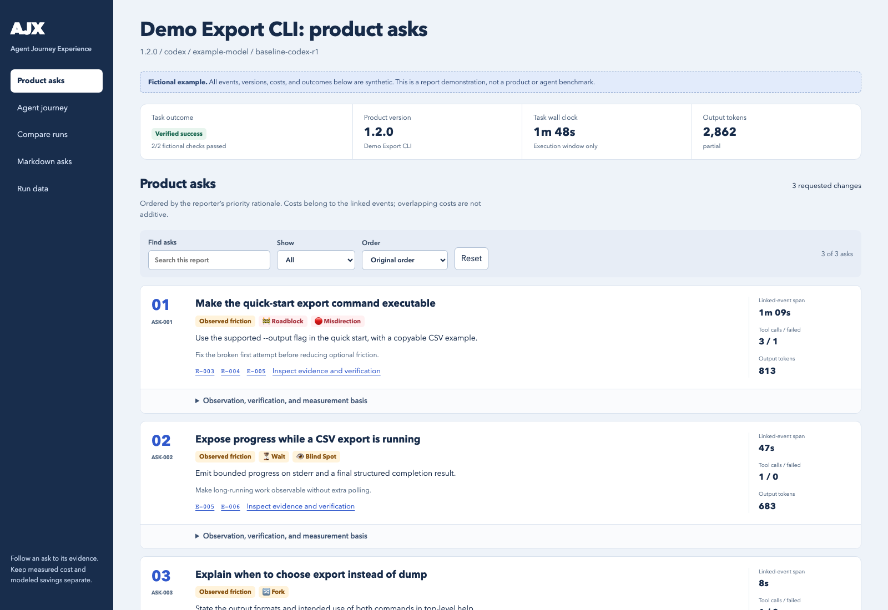
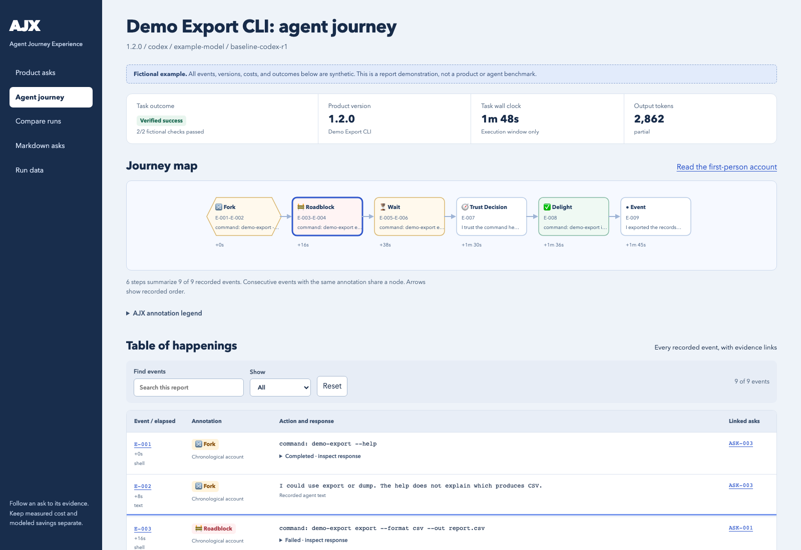
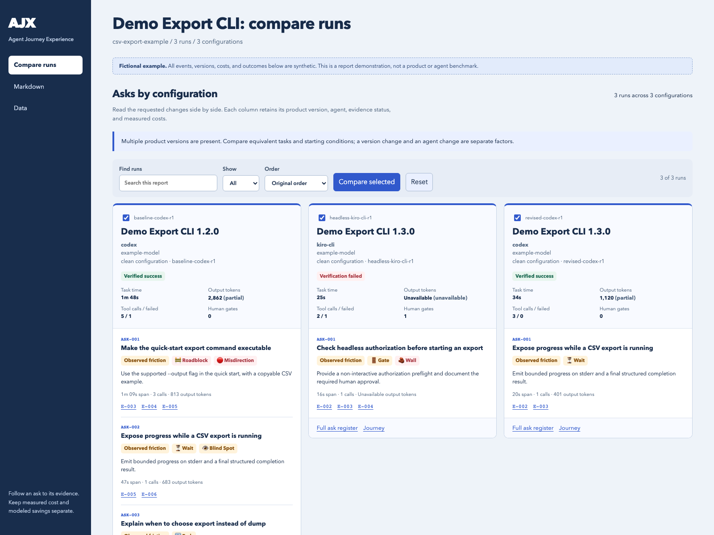

# AJX

Find where agents struggle with your product and turn the evidence into concrete product changes.

## Get started

AJX works as an **Agent Skill** in **Codex, Claude Code, Kiro CLI**, and other harnesses that support the common `SKILL.md` format and can run local scripts. You need Python 3.11+ on macOS or Linux and a login for your chosen agent CLI.

**1. Clone the repository.**

```sh
git clone https://github.com/royosherove/ajx.git
cd ajx
export PATH="$PWD/skills/ajx/bin:$PATH"
```

**2. Install the skill in your harness.** Run the command for your harness from the checkout:

| Harness | Install command |
|---|---|
| Codex | `mkdir -p ~/.agents/skills && ln -s "$PWD/skills/ajx" ~/.agents/skills/ajx` |
| Claude Code | `mkdir -p ~/.claude/skills && ln -s "$PWD/skills/ajx" ~/.claude/skills/ajx` |
| Kiro CLI | `mkdir -p ~/.kiro/skills && ln -s "$PWD/skills/ajx" ~/.kiro/skills/ajx` |
| Another Agent Skills host | Copy the complete `skills/ajx` folder into its documented skills directory. |

If `ajx` is already installed, move the existing skill aside deliberately. Start a fresh agent session after installing. Kiro custom agents also need the skill in their resource configuration; see [harness setup](docs/HARNESS-SUPPORT.md).

**3. Ask for a review.** Paste this into your agent:

```text
Use the AJX skill to review jq. Have a fresh agent convert three fictional
orders from JSON to CSV and verify every row. Use my current harness where
supported, run one local trial, and show me the plan before starting.
Return prioritized product asks and a visual journey of what happened.
```

You can explicitly invoke `$ajx` in Codex or `/ajx` in Claude Code and Kiro CLI. Replace the example with your CLI, API, SDK, or documentation and a task your users actually need to complete. The coordinator checks the available tools and helps define the task and boundaries.

## See the reports

Try the report viewer without running an agent:

```sh
ajx example trials/example
# Open trials/example/index.html in your browser.
```

The [bundled example](docs/example-report/) uses entirely fictional commands, versions, events, and measurements. The screenshots below come from the actual HTML renderer. They are demonstrations, not benchmark results.

### Product asks first

`report.html` starts with prioritized changes, evidence status, and measured costs. Expand an ask for its observation, workaround, verification steps, measurement basis, and optional modeled saving. Filter or sort the register when planning fixes.



### A visual agent journey

`pretty-journey.html` includes a clickable event map, a filterable **table of happenings**, and the first-person account. Forks, roadblocks, detours, waits, gates, trust decisions, and helpful behavior use AJX's annotation icons. Every mapped node links to recorded evidence. Reconstructions and evidence gaps stay labeled.



### Compare configurations and product versions

`index.html` puts each run's asks side by side, with product version, harness, model, outcome, time, tokens, and gates visible. Select the runs you want to compare, then inspect the full technical table and comparability notes. A reporting failure remains an incomplete review; it never becomes a zero-ask success.



These are self-contained HTML files. Open them locally; no hosted service or internet connection is needed to read a generated report.

## What AJX does

AJX means **Agent Journey Experience**. This is **AJX v1**, its first public version.

A worker attempts a real task using the materials a user would receive. After the task stops, AJX records the agent's journey, extracts concrete product asks, links them to evidence, and computes available costs. The original agent narrates when its adapter supports resumption; otherwise a reporter creates an explicitly labeled reconstruction.

Code computes measured time, tokens, and tool-call costs. Models describe observations and requested changes. Several asks may share an event, so their costs overlap. Modeled savings require stated assumptions and a comparable follow-up run before they can become measured improvements.

| Artifact | Purpose |
|---|---|
| `report.html`, `asks.md` | Prioritized asks, evidence, costs, and verification steps |
| `pretty-journey.html`, `journey.md` | Event map, happenings, and the agent's chronological account |
| `run.json`, `measurements.json`, `events.jsonl` | Outcome, configuration, measurement coverage, and source events |
| `index.html`, `matrix.md`, `matrix.json` | Per-run asks and measurements across the matrix |

Read the [FAQ](docs/FAQ.md) for the method, evidence limits, and how to interpret comparisons.

## Configure a trial directly

Choose `codex`, `claude-code`, or `kiro-cli` for both the worker and reporter, or select the reporter separately with `--reporter`:

```sh
ajx init trials/my-cli --product my-cli --harness codex
$EDITOR trials/my-cli/trial.toml trials/my-cli/task-prompt.md
ajx validate trials/my-cli/trial.toml
ajx doctor trials/my-cli/trial.toml
# Review the plan, permissions, credentials, and possible costs before running.
ajx run trials/my-cli/trial.toml
ajx status trials/my-cli/trial.toml
```

The automated runner also has worker adapters for Gemini CLI, Cursor Agent, and GitHub Copilot CLI, plus custom command templates and Python plugins. Skill installation and worker-adapter support are described separately in [harness setup](docs/HARNESS-SUPPORT.md). Run `ajx plugins` to inspect capabilities and live verification status.

The [annotated trial file](skills/ajx/examples/trial.toml), [jq task](skills/ajx/examples/jq-smoke/), and [cloud task](skills/ajx/examples/aws-cloud/) provide configuration examples. Existing evidence can be rendered again without model calls:

```sh
ajx report trials/my-cli/trial.toml --no-synthesis
```

## Run and share deliberately

Workers execute commands with their process permissions and may bypass interactive approvals. Use disposable workspaces and limited credentials, agree on task boundaries, and investigate cleanup failures. Agent and reporting calls may incur provider charges.

Reports and archived workspaces can contain private task content. Keep real runs in the ignored `trials/` directory, and review output before sharing. See [SECURITY.md](SECURITY.md).

## Develop and contribute

The runtime uses the Python standard library. Offline tests use synthetic fixtures and fake agents:

```sh
python3 -I skills/ajx/tests/test_ajx.py
```

See [CONTRIBUTING.md](CONTRIBUTING.md), [ARCHITECTURE.md](docs/ARCHITECTURE.md), the [coordinator skill](skills/ajx/SKILL.md), and the [reporting method](skills/ajx/references/reporting.md). The [release checklist](docs/releasing.md) covers later publication.

For future work, the [execution environments proposal](docs/design/execution-environments.md) explores disposable AWS developer machines, explicit permissions, and reproducible scenario comparisons. These capabilities are not implemented.

Licensed under [MIT](LICENSE).
