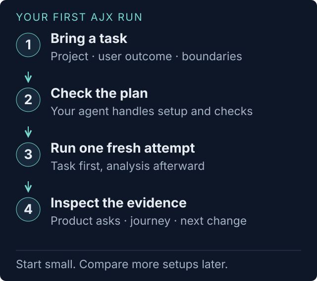
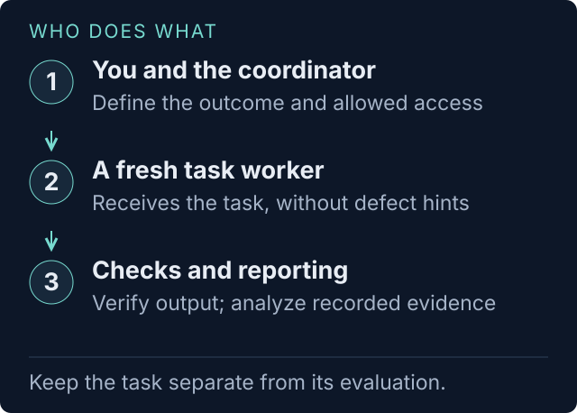
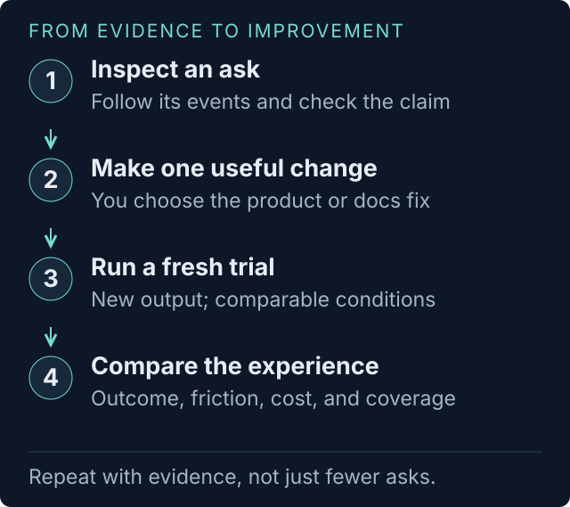

# AJX

## Get started: see your product through an agent's first attempt

Give AJX a **project and a real user task**. Your agent prepares a trial, a fresh
worker attempts the task, and AJX returns **product asks with evidence** and a
**visual journey**. Start with one attempt; add comparisons after you understand it.

AJX means **Agent Journey Experience**. This is its first public version, AJX v1.



**Why run it?** Find confusing setup, unclear errors, missing instructions, and
workarounds that a passing test might miss. Each supported ask gives your team a
change to consider, the events behind it, and a way to check the result of a fix.
A trial describes the tested task and conditions, not a universal product score.

### 1. Get the skill

For a real trial, you need:

- **macOS or Linux, Git, and Python 3.11+.** No Python packages to install.
- **An agent with file and shell access**, such as Codex, Claude Code, or Kiro CLI.
- **An installed, authenticated agent CLI** for the worker and reporter. The
  coordinator helps check compatibility; a desktop chat login alone may not
  authenticate a separately installed CLI.
- **A small task and permission to run it.** Start with fictional data in a
  disposable workspace. No AWS account or Docker is required for a local trial.

Clone AJX, or use your existing checkout if you are trying a particular branch:

```sh
git clone https://github.com/royosherove/ajx.git
cd ajx
python3 --version
```

Install the **complete skill folder** for the agent you use to coordinate:

| Your agent | Run from the AJX checkout |
|---|---|
| Codex | `mkdir -p ~/.agents/skills && ln -s "$PWD/skills/ajx" ~/.agents/skills/ajx` |
| Claude Code | `mkdir -p ~/.claude/skills && ln -s "$PWD/skills/ajx" ~/.claude/skills/ajx` |
| Kiro CLI | `mkdir -p ~/.kiro/skills && ln -s "$PWD/skills/ajx" ~/.kiro/skills/ajx` |
| Another Agent Skills host | Copy `skills/ajx` into its documented skills directory. |

Start a fresh agent session. If a skill already exists at the destination,
inspect it before replacing it. Kiro custom agents need a skill resource entry;
see [harness setup and adapter support](docs/HARNESS-SUPPORT.md).

**Want to see the result first?** From the checkout, generate fictional reports
without installing a skill, logging in, or calling a model:

```sh
python3 skills/ajx/bin/ajx example trials/example
# Open trials/example/index.html in a browser.
```

### 2. Give your agent this first brief

Paste this into the agent where you installed AJX. Use `$ajx` in Codex or `/ajx`
in Claude Code and Kiro CLI if you prefer an explicit invocation.

```text
Use the AJX skill to try jq as a new user would.

Task: convert three fictional orders from JSON to CSV, preserving the order,
column names, and every value. Check the actual CSV after the worker stops.
Materials: jq's built-in help only.

Start with one attempt using my current agent CLI if supported.
Check Python, the worker and reporter CLIs, authentication, and jq first.
Use a disposable local workspace; no cloud resources or system installations.
Propose a short time limit and explain any model costs and access limits.
Show me the task, success check, environment, and run plan before starting.

Afterward, open the report and visual journey. Explain the top product asks,
what evidence supports them, and what I should try changing next.
```

Replace **jq**, the **task**, and the **materials** with your own CLI, SDK, API,
or project. For example: “Use the quickstart to create a local project and save
a successful response.” You do not need to write TOML or choose a matrix first.

### 3. Check the small plan, then let AJX run

Your coordinator checks setup and proposes defaults. Supply what it cannot
infer: the intended user outcome, allowed materials, permissions, and any limits.
The [first-run guide](docs/GETTING-STARTED.md) shows a sample plan and common fixes.

| You decide | Your coordinator handles |
|---|---|
| What a user should accomplish | A neutral task prompt and a check of the actual result |
| Which materials the user would have | Giving the worker those materials, without hints about expected defects |
| What the worker may access or change | Checking the CLI, authentication, environment, and cleanup requirements |
| Whether the proposed scope is right | Writing the trial, running checks, launching, and opening the reports |

The task worker receives the task, not your discussion of suspected problems.
AJX analyzes evidence after the attempt. Model and reporting calls can cost
money; budget enforcement depends on the adapter. A fresh local directory
**does not sandbox filesystem or network access**. Workers may bypass tool
approval prompts. Choose a supported container profile when you need enforced
boundaries; your coordinator should explain this choice before launch.



Expect a setup check, the task attempt, verification and cleanup, then narration
and reporting. Reporting adds time and model calls after the task ends. If the
worker blocks or times out, AJX preserves the available evidence. Incomplete
reporting stays labeled; an empty asks list is not proof of success.

## What you get back

Open `index.html` in the output directory first. These are local HTML files;
you need no hosted AJX service to read generated reports.

The screenshots and [bundled reports](docs/example-report/) below use **fictional
commands, versions, events, and measurements**. They demonstrate the actual
renderer, not benchmark results.

### Decide what to improve: product asks first

`report.html` starts with prioritized changes. Expand an ask to see the
observation, workaround, evidence, measured cost, and verification steps.
Filter or sort the register to plan work.


### Understand why: follow the journey

`pretty-journey.html` includes a clickable event map, a filterable **table of
happenings**, and the first-person account. Forks, roadblocks, detours, waits,
gates, trust decisions, and helpful behavior have distinct annotation icons.
Reconstructed accounts and evidence gaps stay labeled.


### Compare the experience: asks for every configuration

`index.html` puts each run's asks alongside its version, harness, model, outcome,
time, tokens, and gates. Select runs to compare, then inspect the technical
table and comparability notes.


| When you want to… | Open… |
|---|---|
| Start reviewing or compare runs | `index.html` |
| Prioritize a change | Per-run `report.html` or `asks.md` |
| Reproduce the obstacle | Per-run `pretty-journey.html` or `journey.md` |
| Inspect the evidence programmatically | `run.json`, `measurements.json`, `events.jsonl`, `matrix.json` |

Measured time, tokens, and tool calls come from code and available telemetry.
Modeled savings remain estimates. Several asks can share an event; do not add
their costs as independent savings. See the [FAQ](docs/FAQ.md).

## After your first report

Pick one supported ask, make a product or documentation change, and request a
fresh trial with comparable conditions. Use a new output directory: rerunning
the old directory resumes its saved attempt.



| Next question | Where to go |
|---|---|
| How do I choose a task or recover from a setup problem? | [First-run guide](docs/GETTING-STARTED.md) |
| Can I see the flow interactively? | Open [the visual walkthrough](docs/start-here.html) locally after cloning |
| How does another harness or model perform? | [Harness support](docs/HARNESS-SUPPORT.md) and [trial options](skills/ajx/examples/trial.toml) |
| What if the worker has different tools, skills, or access? | [Environment and agent profiles](skills/ajx/references/environments.md), with a [plain vs guided CSV example](skills/ajx/examples/environment-profiles/) |
| Can a pipeline run this without an interview? | [Headless execution](skills/ajx/references/headless.md). Full acceptance gating is still proposed; task verification failure can return exit code zero. |
| How does the evidence become a report? | [Architecture](docs/ARCHITECTURE.md) and [reporting method](skills/ajx/references/reporting.md) |

The skill can coordinate from a compatible Agent Skills host; launching a
worker requires a supported CLI adapter. Local and local Docker environments
are implemented. Remote provisioning, selected plugins/hooks, a live dashboard,
and automated acceptance/improvement loops remain [designs](docs/design/).

## Work directly with the CLI

The skill uses this same CLI. For a hand-written trial:

```sh
export PATH="$PWD/skills/ajx/bin:$PATH"   # from the AJX checkout; current shell only
ajx init trials/my-cli --product my-cli --harness codex
$EDITOR trials/my-cli/trial.toml trials/my-cli/task-prompt.md
# Replace the scaffold's task and add a check of the requested outcome.
ajx validate trials/my-cli/trial.toml
ajx doctor trials/my-cli/trial.toml
# Run only when the scope is authorized and doctor reports ready.
ajx run trials/my-cli/trial.toml
ajx status trials/my-cli/trial.toml
```

Choose `claude-code` or `kiro-cli` instead of `codex` as needed. `init` selects
the same reporter when supported; use `--reporter` to choose another.
`ajx plugins` describes adapters and their validation status. To rebuild
existing reports without model synthesis: `ajx report trial.toml --no-synthesis`.

## Share and contribute

Keep real runs in the ignored `trials/` directory. Reports and archived
workspaces can contain private task content; review them before sharing.
See [SECURITY.md](SECURITY.md).

The runtime uses the Python standard library. Tests use synthetic fixtures:

```sh
python3 -I -m unittest discover -s skills/ajx/tests -p 'test_*.py'
```

See [CONTRIBUTING.md](CONTRIBUTING.md), the [coordinator skill](skills/ajx/SKILL.md),
and the [release checklist](docs/releasing.md). Licensed under [MIT](LICENSE).
