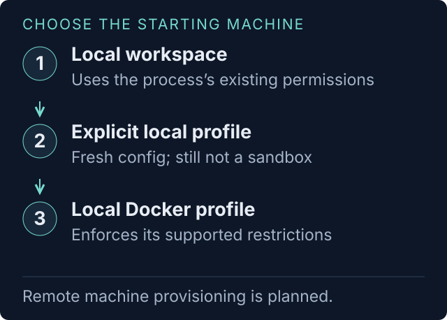

# Your first AJX trial

Start with one user outcome, one supported worker, and one attempt. Your first
report should help you decide what to investigate or improve. A broader matrix
can come afterward.

For installation and a copyable first prompt, start with the
[README](../README.md#get-started-see-your-product-through-an-agents-first-attempt).
For a visual version, open [start-here.html](start-here.html) in a browser from
your checkout. It links to the fictional example reports.

## Bring a task, not a test configuration

Give your coordinator these three things. It should reuse any you already
provided and ask only for information that changes the trial.

| Bring | Example | Why it matters |
|---|---|---|
| The project and user materials | “This CLI checkout and its quickstart” | Defines the experience a new user actually receives |
| An observable outcome | “Create a local project and save a response containing the submitted message” | Lets a separate check establish what worked |
| Boundaries | “Disposable local files, no cloud resources, no system installs, one attempt” | Sets the scope and exposes whether stronger isolation is needed |

You can say “help me choose a task.” The coordinator should offer a small,
concrete option using what you supplied. You do not need to know model names,
auth profile syntax, or TOML.

Keep suspected bugs and recommended workarounds out of the worker's task.
If you share them with the coordinator, they must not become hints in the
prompt, setup, or success check. Otherwise you would be testing a guided repair
instead of the initial user experience.

## Let the coordinator check readiness

The coordinator checks Python, installed worker/reporter CLIs, their adapter
capabilities, the selected authentication route, and required starting tools.
It writes a trial and uses `validate` and `doctor` to check it. It should
explain a missing prerequisite in terms of the next action you can take.


- **Your coordinator** loads the AJX skill and manages the trial with you.
- **The task worker** is a separately launched CLI process. It needs an adapter
  and working model authentication. The same CLI can also supply the fixed
  reporter, which runs after the task.

Installing the skill does not install every worker CLI. A compatible coordinator
host does not imply that its CLI has a supported worker adapter. Use
[the support table](HARNESS-SUPPORT.md) to check both roles.

## Review a plan you can understand

Here is an **illustrative plan**, not a completed trial:

| Part | What a first plan should say |
|---|---|
| Task | Convert three fictional orders into CSV using jq; built-in help is available |
| Success | A separate check parses the output and compares column names, row order, and all values |
| Worker | One installed, supported CLI, its configured default model, one attempt |
| Reporter | One supported reporter, kept fixed; its model/auth choice is explicit |
| Starting machine | Disposable local directory; jq is already installed |
| Access | No task cloud calls or system installs requested; the local process still has its OS permissions |
| Time and cost | A proposed five-minute task limit, separate reporting time, provider charges and adapter budget limits explained |
| Cleanup | Local files handled by AJX; any external resource would need an explicit cleanup plan |
| Output | An ignored `trials/` location; open the generated `index.html` first |

The coordinator should use your existing authorization when it covers this
scope. If you asked to see a plan first, it should wait for your go before
launching. It should not ask you to repeat answers or approve each internal step.

### Choose the machine only as far as your task needs

An **environment** is the starting machine, tools, directories, permissions,
network, and lifetime. An **agent profile** selects the worker's skills and
optional extensions. Neither is a prerequisite to learning what AJX reports.



| Need | Practical starting point |
|---|---|
| Try one low-risk local task | The installed CLI in a fresh local workspace; inspect inherited configuration and access limits |
| Reproduce starting tools/configuration | An explicit local environment profile; this still is not a security sandbox |
| Restrict filesystem access and resources | A supported local Docker profile with a preloaded, pinned image, installed harness, and explicit credentials |
| Compare with and without a skill | Explicit agent profiles using `none` and a selected skill directory; hold the task and reporter fixed |
| Provision a remote developer machine | Planned; current AJX backends do not provision it |

A local worker may access directories and networks its process can access,
even if the task asks it not to. A container enforces the supported restrictions
it declares; it needs a usable model-provider connection when running real agents.
Required restrictions that a backend cannot enforce should block the run.

Fresh explicit profiles also change authentication. Codex can use a supported
copied-login profile; Claude profiles need API/cloud-provider credentials;
Kiro profiles need an explicit `KIRO_API_KEY` and its chat companion executable.
Do not assume your usual terminal login works in an empty home directory.
See [environment setup](../skills/ajx/references/environments.md) when you choose
this path. Optional plugins and hooks currently support `none` only.

## Know what happens while you wait

| Phase | What happens | What you learn |
|---|---|---|
| Prepare | AJX creates starting directories and checks prerequisites | Whether the worker can start under the agreed conditions |
| Attempt | The worker sees the user task and tries to complete it | The actual commands, obstacles, decisions, and output |
| Check and clean up | AJX checks the requested result and attempts task cleanup | Verified outcome and whether cleanup succeeded |
| Explain and report | Narration, environment release, evidence analysis, and rendering | Product asks, journey, costs, and explicit evidence gaps |

The task timer does not include all setup and reporting time. Your coordinator
can inspect `ajx status <trial.toml>` while the run proceeds. A dedicated live
dashboard is planned; final HTML reports appear during rendering stages.

A blocked or timed-out attempt can still produce useful evidence. The
coordinator should say where it stopped and whether reports and cleanup are
complete. A retry of the same output resumes saved work; it never silently gives
the worker a fresh attempt.

## Read the result in this order

1. **Open `index.html`.** Check which run finished, its verified outcome,
   report completeness, and cleanup status.
2. **Read the top asks in `report.html`.** Look for a concrete change,
   supporting events, and a check that would demonstrate improvement.
3. **Follow `pretty-journey.html`.** Inspect the fork, roadblock, detour, wait,
   or gate behind an ask, using the event map and happenings table.
4. **Inspect measurements and gaps.** Missing tokens are unknown, not zero.
   Modeled savings are estimates. Overlapping asks can share the same cost.

The [fictional example reports](example-report/) show all three views. You can
generate another copy offline with the README's `example` command.

## Turn an ask into a follow-up


Ask your agent:

```text
Use this AJX report to help me choose one product ask to address.
Show its evidence and the check that would demonstrate improvement.
After I choose the change, prepare a fresh follow-up trial with the same
task and comparable conditions. Show what will stay fixed and what changes.
```

Use a new output directory for a changed product or task. Keep the task,
materials, starting tools, permissions, and reporter comparable. Change one
factor at a time where practical; label intentional differences. Additional
repetitions help reveal variation, and every extra attempt can add model costs.

AJX does not automatically fix the project or certify release readiness.
Prepared trials can run [headlessly](../skills/ajx/references/headless.md);
full product acceptance gating is proposed.

## If you get stuck

| What you see | Next step |
|---|---|
| The agent cannot find AJX | Check the complete skill folder and installation destination, then start a fresh session. Kiro custom agents need a resource entry. |
| `ajx: command not found` | From the checkout, use `python3 skills/ajx/bin/ajx …`, or add that `bin` directory to this shell's `PATH`. |
| The coordinator runs, but the worker cannot start | Check the separate CLI installation, adapter status, and selected auth route. Run `doctor` on the prepared trial. |
| `doctor` says `NOT READY` | Resolve the named prerequisite before launching. Do not bypass it with a prompt instruction. |
| The local machine cannot enforce a requested restriction | Choose a qualified container profile, or explicitly revise the scope after discussing the access limit. |
| A run is interrupted | Resume the unchanged trial/output. Keep evidence; use a fresh output for a new attempt. |
| Task or environment cleanup fails | Treat cleanup as unfinished. Follow the reported recovery path and [environment recovery guidance](../skills/ajx/references/environments.md#setup-verification-and-cleanup). |
| There are no asks | Check task verification and report completeness before interpreting the result. Missing analysis does not mean an easy experience. |
