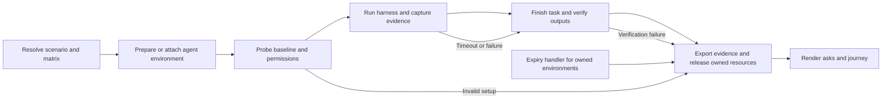

# Proposal: configurable agent environments

**Status: proposed; not implemented.** Reviewed on 2026-10-07.

AJX should let a product team ask: **Can agents install and use this product
successfully across the environments and agent configurations our users have?**
The machine, its permissions, and the agent's skills, plugins, and hooks should
be explicit inputs alongside the harness, model, and product version.

An **agent environment** is the execution context for the worker and its tools:
operating system, installed software, files, permissions, network access, and
resource limits. A profile describes that context; a backend determines where
and how it runs. The same contract can apply to a local process, container,
remote machine, or an environment hosted on AWS.

Start with configurable local and container environments, then qualify remote
backends. AWS is an optional hosting choice. A profile can attach to an existing
environment or request a temporary one, with explicit ownership and cleanup.
The purpose is to compare product usability under declared agent conditions.

Today AJX has local, Docker, and wrapper runners, setup/verification/teardown
checks, and recorded evidence. It does not provision these proposed environments
or enforce the policies below. An isolated harness configuration is not a
filesystem sandbox.

## Environment profile and execution backend

Keep the portable profile separate from backend-specific connection and hosting
settings. A profile should declare its OS/architecture, initial tool inventory,
workspace and directory access, installation privileges, sandbox, network policy,
agent extensions, resource limits, and starting state.

The backend resolves that profile, reports which requirements it can enforce,
and records the actual environment used. Selecting an AWS backend changes the
hosting configuration; it does not change the task, acceptance checks, or
definition of product usability.

The product's external services, if a task uses them, remain part of its explicit
setup, permissions, verification, and teardown contract. The environment feature
manages the agent's execution context.

## The scenario is a contract

A scenario should answer these questions before a worker starts:

| Contract | Required information |
|---|---|
| User goal | The task, intended user context, public materials supplied, and whether a human can answer questions. |
| Starting state | Product absent or installed; fixtures and declared external dependencies; OS and architecture; tools already present; empty or warm caches. |
| Environment needs | Shell, native binaries, package installation, outbound network, writable paths, background processes, local ports, and optional PTY/SSH requirements. |
| Permissions | Filesystem grants, access to adjacent directories, privilege escalation, tool approval behavior, network destinations, and task account permissions. |
| Agent configuration | Skills, plugins, and hooks enabled or disabled for the worker; their resolved versions, configuration, discovery scopes, and bundled dependencies. |
| Success | Observable outputs and required checks, with an explicit scope for what each check proves. |
| Stop conditions | Worker completion, harness failure, cancellation, wall-time limit, and any enforceable token/tool/spend limits. |
| Evidence and cleanup | What must be captured, where it is stored, retention, resource ownership, cleanup verification, and maximum environment lifetime. |

“Empty” means empty of the product, its configuration, solved examples, and
previous attempts. The base OS, harness, execution adapter, and declared bootstrap
tools still exist. Record that inventory. A package-rich managed runtime and a
minimal Linux image are different starting states.

The coordinator can propose this contract from the user's goal and check it for
contradictions. It should disclose relevant restrictions to the worker as normal
task context without exposing verifier implementations, reference solutions, or
reporting instructions. Fresh sessions cannot erase a model's prior training.

For a successful-use scenario, validate a reference path under the same
permissions. For an intentional negative test, such as installing a root-only
product without root, define the expected refusal or diagnostic instead. Do not
silently relax permissions to make a cell pass.

## Completion and stopping are different results

Keep these results separate:

| Result | Example |
|---|---|
| Execution stop reason | Agent finished, process crashed, deadline reached, or user cancelled. |
| Task verification | All required checks passed, partial completion, failure, or verification unavailable. |
| Environment validity | The promised baseline and permissions were confirmed, unsupported, or could not be established. |
| Cleanup | Confirmed, failed, or unknown. |

A zero process exit or “done” in the final message does not prove completion.
An agent can also time out after producing a valid artifact. Preserve both facts.
Infrastructure failure before the worker starts is an invalid attempt, with its
own count, rather than a product failure or a missing row.

For an export task, a useful success contract might require an output file that
parses as CSV, contains exactly the expected rows and values, and leaves the input
unchanged. File existence alone is insufficient. For a deployment task, check the
live endpoint and its behavior under a separately scoped verifier identity.
Bound polling for eventual consistency and record the polling window.

Stop or quiesce the worker, capture its outputs, and then verify. Keep trusted
check code and credentials out of worker-controlled storage. Treat submitted
files as untrusted input; do not execute agent-generated verification code with
the verifier's privileges. Use deterministic checks where possible. If a judgment
requires a model, record its rubric, model, uncertainty, and evidence separately
from the worker and reporter.

## Permissions must describe real boundaries

The environment provider should resolve a policy into enforceable settings and
return a capability report. Probe permitted and denied operations on synthetic
sentinel resources before the task. Probes provide evidence of tested operations,
not proof that every possible escape path is absent.

| Dimension | What a run records |
|---|---|
| Filesystem | Workspace, isolated agent home, scratch space, read-only fixtures, system runtime paths, and each additional mounted directory with read/write access. Unlisted personal and sibling workspaces are absent. |
| Privilege | Effective user, allowed package installation locations, whether sudo/root is available, and the boundary outside which guest administration grants no access. |
| Harness tools | Shell/file tools, approval mode, headless behavior, and harness sandbox settings. Auto-approval is distinct from OS or IAM access. |
| Network | Registry, documentation, model-provider and product endpoints; offline/public/allowlisted mode; inbound ports; metadata access; enforcement mechanism. |
| External-service identity | Task identity and allowed resources, separate from credentials used for model inference, environment management, and verification. |
| Runtime | CPU, memory, disk, process/command limits, background process and PTY support, and lifetime limits. |

Start with three profiles:

1. **Workspace only:** read system tools and fixtures; write the workspace,
   private agent home, and scratch space; install user-level tools; no sudo or
   access to other workspaces.
2. **Guest administrator:** allow system package installation inside a disposable
   VM. Do not claim directory restrictions inside that VM remain secure against
   its administrator. The meaningful boundary is outside the guest.
3. **Restricted workspace:** allow workspace outputs but constrain package
   installation and network access. Useful for testing offline, locked-down, or
   noninteractive onboarding.

A read-only task against an external service may still need local write access
for configuration and results. Filesystem and service permissions are separate
dimensions. SSH is an execution or debugging transport, not a permission profile.

Every policy item needs an enforcement state: `enforced`, `observed-only`,
`unsupported`, or `unknown`. A backend that cannot enforce a required restriction
must reject that configuration before execution. An explicitly observational run
can proceed under a different, honestly labeled contract.

Environment-management credentials must remain outside the worker. Do not expose
host privileges through management endpoints, container-engine sockets, or host
mounts. A network allowlist needs actual enforcement; a list in TOML or a prompt
is not a network boundary.

## Control skills, plugins, and hooks independently

An agent configuration profile should control **skills**, **harness plugins**,
and **hooks** separately for each matrix cell. Here, plugins mean extensions
loaded by the agent harness; AJX's own runner, auth, check, and reporting plugins
remain part of the test infrastructure.

Each category should support three modes:

| Mode | Meaning |
|---|---|
| None | Disable optional entries in this category through the adapter's supported controls and isolated configuration. Record anything mandatory that remains active. |
| Selected | Enable only named, pinned entries. The plan resolves their dependencies and rejects contradictory selections. |
| Snapshot | Capture an explicit snapshot of the chosen user's configuration, resolve all entries before the run, and recreate it in an isolated environment. Do not inherit a changing live configuration. |

Start with a plain baseline with optional skills, plugins, and hooks disabled.
Useful comparison profiles include a product skill alone, a product plugin with
its bundled features, selected hooks, and a snapshot of a typical user's setup.
Paired runs can then ask whether a product skill removes a roadblock, whether a
plugin makes a workflow discoverable, or whether hooks introduce delay or prevent
an operation. Hold the other inputs fixed and repeat each profile.

### Resolve what the profile actually enables

The adapter should produce a manifest before execution, including:

- Stable identifiers, versions or content hashes, discovery scope, and sanitized
  configuration for every selected skill, plugin, and hook.
- The complete dependency expansion. If a plugin supplies skills, hooks, tools,
  or MCP servers, list those contributions and their effective enabled state.
- Relevant instruction files, memory, startup scripts, and other context sources
  that remain present. Hold these fixed during an extension comparison.
- For hooks: event triggers, order, executable/configuration hashes, timeout,
  execution identity, and whether they can block or modify an operation.
- Adapter capabilities and limitations for the exact harness version.

Do not label a profile “plugin on, hooks off” if the adapter cannot independently
disable that plugin's hooks. Reject an impossible combination or create a
different, explicitly named comparison profile. Resolve name collisions and
dependency conflicts before starting the worker.

Give each attempt isolated agent configuration in its selected environment,
including when it attaches to an existing machine. Do not toggle or remove the
user's installed skills, plugins, or global hook configuration. Pin resolved
content and record any configuration changes during an attempt. Default to
keeping the profile fixed; a scenario that tests extension installation or
configuration changes must declare those changes as part of the task.

If a hook executes with a different identity or outside the worker's sandbox,
verify and record its permissions separately. A workspace-only claim must cover
the extension's execution context too. Attribute startup hooks to preparation or
task time according to the scenario's declared measurement boundary.

Disabling discovery through a harness setting does not necessarily make a skill's
files unreadable to its shell. The profile must state whether it tests **disabled
activation** or **absence of the extension content**. Apply the machine's
filesystem controls when absence is required. If a managed policy, built-in
extension, or discovery source cannot be controlled, record the limitation and
reject profiles that require a stronger boundary.

### Separate configuration from observed use

Record these states separately: **installed**, **discoverable**, **enabled**,
**loaded into context**, and **invoked or executed**. An enabled skill may never be
loaded; missing telemetry must remain `unknown`, not become evidence that a skill
was unused or a hook never ran.

Capture hook start/end events, exit results, blocked operations, and observable
output changes. Link them to the triggering journey event when that relationship
is available. Include hook work in the task's elapsed time, and expose its
contribution without double-counting overlapping intervals. Record additional
context tokens and model costs only when measurable; hook-triggered model calls
need their own provenance and cost coverage.

Use the worker's profile for execution and record what resumption retains during
narration. Keep the reporter and any model-based verifier configuration fixed
across the matrix. AJX's coordinator skill and evaluation instructions should
remain outside the worker's task context; any exposure is an explicit limitation.

The manifest and relevant extension activity should appear in `run.json`, matrix
comparison views, and the journey. Keep asks first, but show whether an obstacle
occurred with the product skill enabled, a particular plugin loaded, or a hook
blocking the command. Improvements attributed to an extension require comparable
follow-up evidence.

This profile model is proposed AJX behavior. Adapters must declare which controls
they support; equivalent extension controls cannot be assumed across harnesses.

## Choose a backend by capabilities

| Backend option | Proposed use of the environment profile |
|---|---|
| **Local process** | Use an isolated workspace and configuration on the current machine. Report limits that the process cannot enforce; select a stronger boundary when required. |
| **Container** | Resolve a pinned image, mounts, user, network, and resource settings into a temporary developer environment. |
| **Remote machine** | Attach through an authenticated execution transport to an explicitly selected machine, with isolated per-attempt state and declared access. |
| **AWS-hosted environment** | An optional adapter can attach to or create a machine or managed execution environment that satisfies the same profile. Verify its capabilities before declaring support. |

Backend-specific details belong in adapter configuration. Validate package
installation, native binaries, writable paths, process behavior, and supported
harnesses through integration trials. No hosting platform is the required
default for AJX.

Environment lifetime, individual command timeout, worker deadline, and cleanup
deadline are separate limits. Existing machines are borrowed resources: release
the trial's session and owned files without terminating or resetting the host.

Hosting a harness inside the environment and giving a local harness a remote
shell tool are also different test configurations. The latter changes the tool
interface the agent uses. Prefer hosting the CLI in the machine for the first
implementation and label any later remote-tool arrangement separately.

## Make the environment a matrix dimension

An attempt is identified by:

```text
product artifact + documentation revision
× scenario revision
× harness version + model/provider + agent settings
× resolved skills + plugins + hooks profile
× resolved environment + permission profile + starting state
× repetition
```

Vary one dimension at a time for causal comparisons. For example, hold the
scenario, harness, model, permission profile, and extension profile fixed while
comparing two product versions; then hold the product fixed while exploring
harness coverage or extension effects.
Cross-environment comparisons remain useful but should show all differing inputs.

Use pinned artifacts and resolved versions, not only mutable image tags or model
aliases. Interleave repeated cells with a recorded ordering seed. Model output
can still vary. Share neither writable caches nor solved-task state across
attempts; a warm-cache scenario must explicitly define what is warmed.

Measure environment preparation and harness bootstrap separately from the
task. If installation is part of the user's product journey, its downloads,
dependency setup, and failures belong inside task time. Report verification,
narration, extraction, and cleanup overhead separately too.

For each comparison, show planned, valid, invalid, completed, timed-out, and
verified-success counts. Preserve missing measurements. Keep unsuccessful
attempts visible when displaying time-to-success; averaging only successful runs
would hide the cost of failure. Report distributions and sample counts before
making improvement claims. Do not rank harnesses from one attempt.

## Explain failures without automatically blaming the product

Link each proposed ask to the events, active policy, and checks that support it.
Allow multiple contributing causes and an `unknown` explanation:

| Observation | Interpretation to test |
|---|---|
| Installation fails because the scenario denies all downloads | Environment constraint; assess the product's offline experience only if that was the intended scenario. |
| A user-level installation path exists, but documentation only describes sudo | Possible documentation/onboarding ask under the workspace-only profile. Validate the working path in a separate follow-up attempt. |
| The harness refuses a command before the product runs | Harness approval or tool restriction; preserve the gate and its impact. |
| A hook blocks a command or a plugin changes its behavior | Agent configuration may contribute to the result; cite the extension manifest and observed events, and compare with the relevant extension disabled when supported. |
| The CLI emits an unhelpful permission error for a declared unsupported operation | The restriction may be correct while the diagnostic still deserves a product ask. |
| Environment preparation fails or the verifier's credentials expire | Environment or verification failure; do not infer product quality from it. |

The HTML reports should continue to put asks first for every configuration.
Add environment, permission, and extension-profile summaries beside the existing
product/harness/model labels, comparison filters, completion checks, and cleanup
status.
`pretty-journey.html` should link gates, roadblocks, forks, and detours to the
specific observed operation and applicable policy. Separate lifecycle events
from the agent's product journey. A blocked call is not automatically a security
violation, and a matrix difference is not automatically a measured product fix.

The separate [live dashboard proposal](live-dashboard.md) extends this view to
active runs: per-attempt status and traces, environment and extension profiles,
and browsable artifact versions before the trial finishes. It keeps partial
results and connection failures distinct from final task outcomes.

The [CI/CD and improvement-loop proposal](ci-and-improvement-loops.md) reuses these
contracts for unattended evaluations and fresh candidate retests. Acceptance
criteria, permissions, and comparison conditions stay fixed during each campaign.

## Lifecycle and integration



A proposed environment adapter should support resolve, prepare/attach, inspect,
execute, collect, and release operations, with durable attempt handles and
explicit ownership of any resources it creates.
Keep the existing harness adapters responsible for their CLI, transcript format,
and resumption semantics.

`Runner.wrap()` alone is insufficient for a managed or remote environment:
fixture transfer, setup and teardown location, transcript collection, remote
paths, process cancellation, verification access, and narrator resumption also
need explicit contracts. Run any same-session narration before releasing its environment;
if that cannot be done, retain the existing labeled reconstruction behavior.
Reporter calls can use exported evidence after the worker is gone.

Persist lifecycle intent, ownership, and environment identifiers before creating
resources, and execution intent before starting the worker. Recovery should
collect or stop an existing attempt, never silently run the task again. Use
idempotent cleanup and lifetime enforcement outside the worker for temporary
environments. A failed release stays actionable; successful task verification
does not erase it.

Track compute, storage, logs, network, and model charges separately where
available. A deadline can be enforced without claiming an exact spend cap.
Provider billing can arrive late, so label estimates and enforcement limits.
Release only sessions, files, and environments owned by the trial. Task-specific
external effects use the task's declared teardown checks. Budget for evidence
export and cleanup before a temporary environment's hard lifetime.

## Illustrative contract

This is a **design sketch**, not a runnable AJX configuration. Names and fields
are provisional.

```toml
[scenario]
id = "export-orders"
revision = "1"
prompt_file = "task.md"
human = "unavailable"
start_state = "product-absent"

[environment]
id = "linux-cli"
backend = "container"
image = "resolved-pinned-linux-image"
architecture = "x86_64"
fresh_per_attempt = true
ownership = "created"

[environment.permissions]
profile = "workspace-only"
read = ["system-runtime", "fixtures"]
write = ["workspace", "isolated-agent-home", "scratch"]
other_directories = "absent"
package_install = "user-level"
sudo = false
network = "declared-endpoints-only"
external_service_access = "none"

[agent_configuration]
id = "product-skill-only"
inherit_live_user_config = false
changes_during_task = "forbidden"

[agent_configuration.skills]
mode = "selected"
enabled = ["product-guide"] # Resolved to a pinned manifest before execution.

[agent_configuration.plugins]
mode = "none"

[agent_configuration.hooks]
mode = "none"

[completion]
required_checks = ["csv-values-match", "input-unchanged"]
verifier_location = "outside-worker"
verify_timeout_seconds = 120

[limits]
worker_timeout_seconds = 1800
environment_lifetime_seconds = 2700
on_expiry = "stop-capture-cleanup"

[lifecycle]
reuse = "never"
cleanup_verification = "required"
```

The coordinator would resolve the image, endpoint policy, tools, credentials,
extension manifest, checks, and resource plan before this becomes executable.
A profile name or symbolic path is not sufficient evidence that its policy has
been enforced.

## Delivery order and acceptance

1. **Contract and offline validation:** scenario/environment and agent-profile
   schemas, capability negotiation, clear outcome categories, fake-provider and
   fake-harness tests, and synthetic report examples. Test extension selection,
   plugin dependency expansion, and unsupported combinations. Keep current local
   workflows compatible.
2. **Local/container pilot:** configurable tool inventory, workspace and directory
   access, installation privileges, sandbox settings, and evidence collection on
   failure. Preserve the host and the user's installed agent configuration.
3. **Reproducible comparisons:** pinned images and extension manifests, policy
   probes, repeated matrices, lifecycle and extension cost/coverage reporting,
   and before/after product comparisons.
4. **Remote backend qualification:** support selected remote machines and optional
   hosted environments, including AWS, through the same capability contract.
   Test attachment, resource ownership, transport failure, and release behavior.

The pilot is complete only when an authorized live trial demonstrates:

- A target CLI can be installed from a declared empty starting state.
- Permitted writes succeed and denied synthetic directory access fails.
- Two fresh attempts cannot read each other's files or configuration.
- Releasing an attached environment leaves the existing host intact; releasing
  a temporary environment cleans up only the trial's owned resources.
- Independent checks distinguish task completion from an agent's claim.
- Worker timeout and coordinator termination both preserve evidence and trigger
  cleanup; failed cleanup prevents reuse.
- At least two CLI harnesses produce comparable, honestly labeled results under
  the same supported environment profile.
- Supported adapters can run a plain baseline and a selected-skill profile
  without modifying the user's configuration. Plugin and hook controls are
  qualified per adapter, with enabled/disabled behavior, dependency resolution,
  and actual-use telemetry checked where available.

This is a design proposal; it does not create or modify an execution environment.
