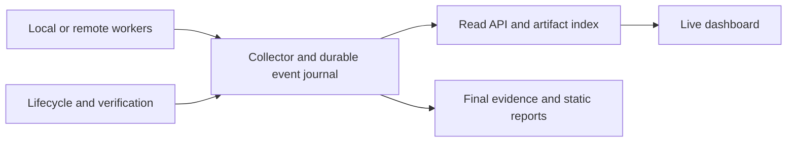

# Proposal: live run dashboard

**Status: proposed; not implemented.** Reviewed on 2026-10-07.

AJX should provide a live dashboard for local and remote trials. A product team
should be able to open a matrix while it is running, follow each attempt's
trace, and browse its output artifacts as soon as they become available.
The view should remain useful after completion, interruption, or a lost connection.

This feature can ship independently of configurable environment management.
It consumes run state wherever the agents execute. The dashboard's location and
the workers' locations are separate choices.

## What the user sees

Use three connected views:

| View | Content while a trial is running |
|---|---|
| Matrix overview | Every planned cell and repetition, including queued attempts; product version, harness/model, environment, permission and extension profiles; current stage, elapsed time, last update, and available measurements. |
| Attempt detail | A live trace of available agent messages, commands, tool results, lifecycle events, and extension activity, with expandable inputs/outputs and a timeline. |
| Artifact browser | The attempt's declared outputs, with a file tree, previews, downloads, freshness, and availability/finality labels. |

The matrix should support filters for stage, outcome, product version, harness,
model, environment, and skills/plugins/hooks profile. Let a viewer pin attempts
side by side without interrupting the run. Keep selection, expanded events, and
scroll position stable as updates arrive. Provide follow-tail and pause-scrolling
controls; pausing the view must not pause collection or execution.

Once asks are available, keep them prominent beside the trace and configuration.
Before extraction finishes, show **asks pending**, not a zero-ask result. Show a
failed extraction explicitly. Completed and still-running attempts should coexist
in the same matrix view.

## Status should explain what is happening

Show the execution stage and the result dimensions separately:

- **Lifecycle:** queued, preparing, executing, verifying, narrating, extracting,
  measuring, rendering, archiving, or terminal. Show cleanup as its own status
  because it can fail independently of task success.
- **Task result:** not yet verified, verified success, partial, failed, or
  verification unavailable.
- **Reporting:** pending, generating, ready, or incomplete.
- **Connection:** live, reconnecting, stale, or disconnected, with the last
  confirmed update.

Only show waiting for input or a permission gate when there is evidence for that
state. Silence from a harness is not proof that it is blocked. A disconnected
viewer or expired collector heartbeat is not proof that the worker failed.
Retain the last known run state and identify the missing connection.

Use counts such as “4 of 12 attempts finished execution; 2 reports ready.”
Do not invent a percentage or ETA from the number of stages completed. Show
available time/token/tool/cost measurements with their coverage and distinguish
partial totals from final reconciled measurements.

## Browse artifacts before completion

Publish each declared output independently of the run's terminal status.
The initial index should list expected reports as pending and discover new
workspace outputs within the configured artifact roots as the worker creates them.

| Artifact | Live behavior |
|---|---|
| Text, logs, and source files | Tail or preview committed byte ranges, search the captured content, and download a labeled snapshot. |
| JSON, JSONL, CSV, and Markdown | Show structured previews when a captured version is parseable; otherwise show text with a partial-content label. |
| Images and other binary files | Show metadata immediately and preview complete, valid captured versions. Keep incomplete versions visibly unavailable for preview. |
| Generated HTML reports and journeys | Open each valid generated version as soon as it is published, even if other attempts or later stages are still running. |
| Other declared outputs | List and download captured versions even when no specialized preview exists. |

Track availability and finality separately: a file can be browsable but still
partial. Include its size, capture time, version, producing stage, and whether it
is still changing. Preserve the version being inspected and notify the viewer
when a newer one exists. Downloads must identify whether they contain a partial
snapshot or a finalized artifact.

Use stable artifact identifiers so links survive workspace archival and remote
copying. Handle truncation, replacement, renaming, deletion, and transfer delays
explicitly. A removed or unavailable output should retain an explanatory entry
when the viewer is authorized to see it. Never silently present an old snapshot
as the latest file.

“Browsable outputs” means the declared artifact collection, not unrestricted
access to the host filesystem. Credentials, private harness configuration, and
unrelated directories are not output artifacts. Apply run-scoped access checks
to listings, previews, traces, downloads, and cached versions.

## Live traces and final evidence

Display what the harness actually exposes. An adapter with only process output
should show that output and its limitation; it should not invent a structured
tool trace. Preserve source timestamps separately from collector arrival times.

Give each live event a stable identity scoped to its attempt and source stream.
Canonical `E-###` evidence identifiers are currently assigned during later
normalization. Preserve a mapping from live events to final evidence where
possible, rather than renumbering events already linked from the dashboard.
Mark events that cannot be matched.

The live journey should show observed operations and their order. Add forks,
roadblocks, gates, and other annotations only when supported by the available
evidence, with their provenance. First-person narration and extracted asks can
appear when their existing stages produce them. A live trace is not a completed
agent account, and browsing it should not trigger extra reporter calls.

When the proposed extension profiles are available, show enabled/loaded/used
skills, plugins, and hooks and link their observed activity to the trace. Keep
worker, verification, narration, and reporting events distinguishable.

## Local and remote access

Support these arrangements with the same viewing model:

| Arrangement | Proposed access |
|---|---|
| Local workers and local dashboard | A local read service bound to loopback, opened in the user's browser. |
| Remote workers and local dashboard | Collect remote state and artifact updates into an authorized local view, or connect through a protected tunnel. |
| Local or remote workers and a hosted dashboard | An authenticated service with encrypted transport and explicit access to selected trials. |

Remote workers should publish through an authenticated collector. Do not require
each worker to expose an inbound web server. Show transport lag, last received
sequence, and artifact synchronization state. Local viewing must not require a
hosted account or cloud deployment.

A hosted dashboard needs explicit sharing and revocable, run-scoped access.
Keep credentials out of URLs and ordinary logs. Sanitize output before sending
it to a shared service and show any resulting coverage limits. Arbitrary agent
output is not guaranteed to be safe to publish, even when the repository is public.

Render logs and Markdown as untrusted content. Preview generated HTML in an
isolated, network-restricted context; artifact scripts must not run with the
dashboard's authenticated origin. Enforce artifact-root boundaries, including
symlink and path-replacement cases. Dashboard credentials, sibling traces,
reporter prompts, and verifier data must remain outside worker access; disclose
local isolation limits when this cannot be enforced.

## Collection and recovery

The runner remains authoritative for lifecycle transitions and execution.
The dashboard observes published state. Opening a page, reconnecting, or reading
an artifact must never execute a task again, change its configuration, inject
instructions, or silently retry an attempt.

Publish a consistent snapshot with a cursor, then deliver incremental events and
artifact revisions. Use per-stream sequence numbers and deduplication. On
reconnection, request updates after the last acknowledged cursor; if history is
unavailable, explicitly resynchronize from a fresh snapshot. Do not imply a total
ordering across machines whose clocks differ.

Bound memory, transfer sizes, and preview sizes. Paginate old events and fetch
artifact ranges instead of repeatedly rereading entire traces. Buffer incomplete
JSONL records and UTF-8 boundaries, and distinguish malformed captured data from a
record still being written. Slow viewers must not block worker output capture.
Any gaps or dropped updates must be visible.

Persist state and artifact manifests outside disposable worker storage. A viewer
can close or restart without affecting the runner; a worker or coordinator failure
should leave the captured evidence browsable. A restarted collector must recover
without duplicating events or confusing a new source process with the old one.
Remote workers should buffer within declared limits during a transport outage and
report gaps when they reconnect.

Browsing should not change the task or invoke a model. Collection and transfer
still consume resources, so record monitoring settings and overhead where
measurable and keep them consistent across comparisons.

## Fit with the current runtime

The existing implementation already provides useful inputs:

- `matrix-plan.json` describes the planned attempts.
- `state.json` is updated at stage transitions through an atomic JSON writer.
- `execute.raw.jsonl` receives flushed, timestamped stdout lines during execution.
- Verification, measurements, normalized events, asks, and HTML files appear as
  their stages complete.

These files are foundations, not an existing live dashboard. The implementation
still needs a read service, artifact indexing during execution, heartbeat and
recovery semantics, incremental adapter support, and remote collection.
Setup/verification/teardown output also needs streaming support if it is to be
visible before each command completes.

Reuse the report visual language and evidence contracts. Preserve self-contained
static reports as the final portable output. The dashboard should follow the
runner's actual lifecycle order and keep the environment and extension profiles
from the [execution environments proposal](execution-environments.md) visible.

The [CI/CD proposal](ci-and-improvement-loops.md) uses this dashboard as an optional
viewer of active pipeline jobs and improvement iterations. Each candidate and
matrix attempt keeps its own identity, and evidence is published during execution
rather than waiting for a final job artifact upload.

## Delivery and acceptance

1. **Local viewer:** read-only matrix, per-attempt trace, live artifact index,
   partial/final labels, and browsing of completed and interrupted trials.
2. **Reliable incremental updates:** durable cursors, reconnect/resync, heartbeat
   status, bounded buffering, artifact revisions, and links to final evidence.
3. **Remote collection and access:** authenticated publishers and viewers,
   protected transport, run-scoped sharing, and outage recovery.
4. **Richer comparisons:** side-by-side traces, extension activity, evolving
   journey annotations, and asks as reporting stages finish.

Use synthetic, controllable workers to verify that:

- All planned cells and repetitions appear before any attempt finishes.
- Output and new files from multiple active attempts become visible before
  those attempts terminate, within a documented update interval.
- Growing or replaced files remain browsable with correct revision and
  partial-content labels; moving a workspace does not break artifact links.
- A dropped connection and collector restart recover without duplicated events,
  false failure labels, or a second task execution.
- A stalled worker, verification failure, incomplete extraction, and failed
  cleanup remain distinguishable.
- Hostile HTML, paths, symlinks, and credential files cannot escape the preview
  or artifact-access policy.
- Disabling or closing the viewer leaves execution and final evidence intact.
- The final static reports remain usable after the live service has stopped.

This proposal does not start a dashboard, expose a port, or publish live run data.
